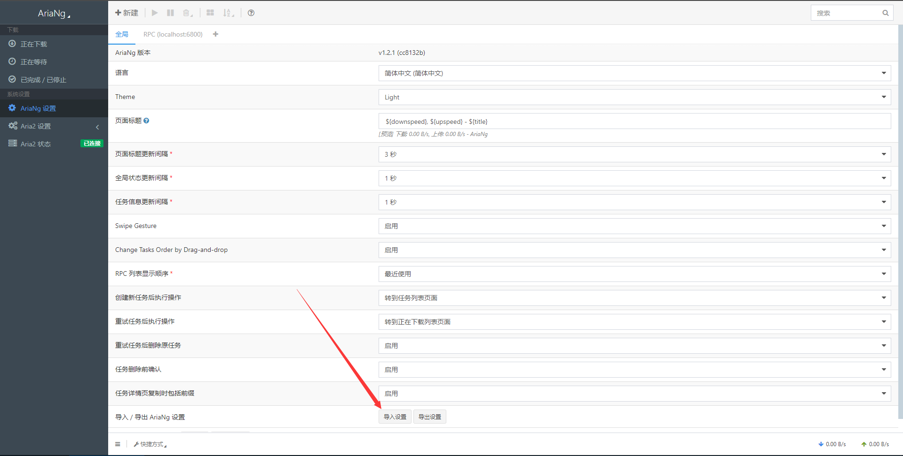

Aria2 - CLI Metalink/BitTorrent Client
========

## 目录

<!-- TOC depthFrom:2 -->

- [使用说明](#1-使用说明)
- [文件说明](#2-文件说明)
- [配置相关](#3-配置相关)
- [引用](#4-引用)

<!-- /TOC -->

## 1. 使用说明
--------
- **运行 “aria2.exe” 或 “AriaNg启动器.exe”**
- 由于aria开始时通过命令行管理，如果熟悉命令行的可以自行通过cmd添加下载
- 如果不熟悉的建议直接运行AriaNg启动器.exe可直接打开默认浏览器进行下载管理,由于本合集整合了懒人版，启动程序后可通过系统托盘显示/隐藏aria2的命令行界面（可直接查看下载进度）
- 下载后的文件默认保存在 Aria2Data 文件夹中
- 请在必要时对aria2主程序和aria2Ng进行更新
- 使用前用记事本打开 aria.conf 修改默认配置
- 关于插件如何添加到浏览器中请自行百度，理论只要是chrome内核浏览器都可以添加插件
- AriaNgConfig.json使用方法

## 2. 文件说明
------------------

Aria2Data      下载目录 默认下载文件保存位置

aria2.conf     配置文件 可以自己根据说明修改

AriaNgConfig.json  AriaNg参考配置文件

aria2.exe      启动文件 使用这个来启动 aria2

aria2.session  任务保存文件 未完成任务会保存在这里

aria2c.exe     命令行主程序

**README.md      README**

## 3. 配置相关
---------
[配置教程](https://zhuanlan.zhihu.com/p/37021947)

[Aria2 配置说明](http://aria2c.com/usage.html)

### Aira2 BT Tracke      

[精选列表](https://trackerslist.com/best_aria2.txt)

[完整列表](https://trackerslist.com/all_aria2.txt)

[HTTP(S)列表](https://trackerslist.com/http_aria2.txt)
## 4. 引用
--------
[aria2主程序](https://github.com/aria2/aria2)

[AriaNg](https://github.com/mayswind/AriaNg/)
    
 [Aira2 BT Tracker：每天更新！全网热门 BitTorrent Tracker 列表](https://trackerslist.com/#/zh) 

