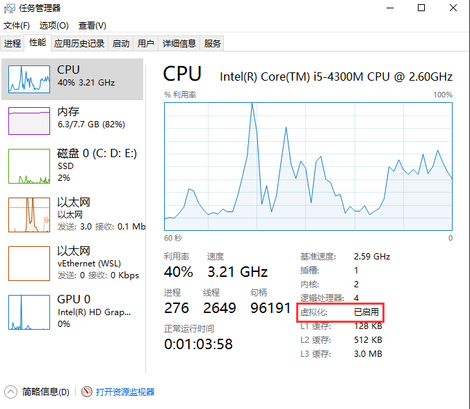
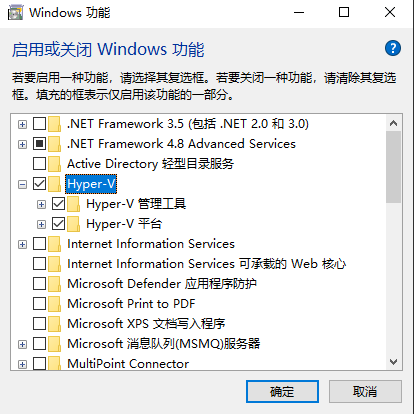
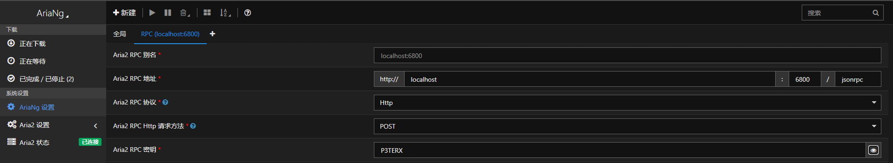
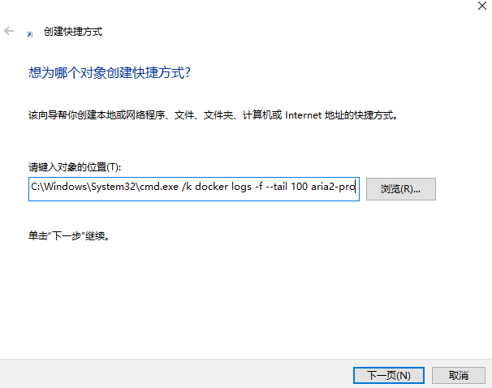

# Aria2 - CLI Metalink/BitTorrent Client

## 目录

<!-- TOC depthFrom:2 -->

- [使用说明](#1-使用说明)
- [文件说明](#2-文件说明)
- [配置相关](#3-配置相关)
- [引用](#4-引用)
- [高手进阶](#5-高手进阶)

<!-- /TOC -->

## 1. 使用说明

- **运行 “aria2.exe” 或 “AriaNg启动器.exe”**
- 由于aria开始时通过`命令行管理`，如果熟悉命令行的可以自行通过cmd添加下载
- 如果不熟悉的建议直接运行AriaNg启动器.exe可直接打开默认浏览器进行下载管理,由于本合集整合了懒人版，启动程序后可通过系统托盘显示/隐藏aria2的命令行界面（可直接查看下载进度）
- 下载后的文件默认保存在 Aria2Data 文件夹中
- 请在必要时对aria2主程序和aria2Ng进行更新
- 使用前用记事本打开 aria.conf 修改默认配置
- 关于插件如何添加到浏览器中请自行百度，理论只要是chrome内核浏览器都可以添加插件
- AriaNgConfig.json使用方法

## 2. 文件说明

Aria2Data      下载目录 默认下载文件保存位置

aria2.conf     配置文件 可以自己根据说明修改

AriaNgConfig.json  AriaNg参考配置文件

aria2.exe      启动文件 使用这个来启动 aria2

aria2.session  任务保存文件 未完成任务会保存在这里

aria2c.exe     命令行主程序

**README.md      README**

## 3. 配置相关

[配置教程](https://zhuanlan.zhihu.com/p/37021947)

[Aria2 配置说明](http://aria2c.com/usage.html)

### Aira2 BT Tracke      

[精选列表](https://trackerslist.com/best_aria2.txt)

[完整列表](https://trackerslist.com/all_aria2.txt)

[HTTP(S)列表](https://trackerslist.com/http_aria2.txt)

## 4. 引用

[aria2主程序](https://github.com/aria2/aria2)

[AriaNg](https://github.com/mayswind/AriaNg/)

[Aira2 BT Tracker：每天更新！全网热门 BitTorrent Tracker 列表](https://trackerslist.com/#/zh) 

## 5. 高手进阶

目前P3TERX大佬接手aria2，有docker的可以尝试使用由P3TERX编写的[aria2-pro](https://p3terx.com/archives/docker-aria2-pro.html)     [源码仓库](https://github.com/P3TERX/Aria2-Pro-Docker)

相关博客链接：
- [Aria2 Pro - 更好用的 Aria2 Docker 容器镜像](https://p3terx.com/archives/docker-aria2-pro.html)
- [群晖 NAS Docker 进阶教程 - 部署全能下载工具 Aria2 Pro](https://p3terx.com/archives/synology-nas-docker-advanced-tutorial-deploy-aria2-pro.html)
- [docker镜像下载](https://hub.docker.com/r/p3terx/aria2-pro)
- [Rclone 安装配置教程](https://p3terx.com/archives/rclone-installation-and-configuration-tutorial.html)
- [Watchtower - 自动更新 Docker 镜像与容器](https://p3terx.com/archives/docker-watchtower.html)(tips:该文章watchtower版本为1.24，而目前镜像最新版本为1.25，默认自动更新时间为1天一次)
- [Aria2 前端面板 ( GUI、WebUI ) AriaNg 使用教程](https://p3terx.com/archives/aria2-frontend-ariang-tutorial.html)  个人推荐使用[AriaNg单文件版AllInOne](https://github.com/mayswind/AriaNg/releases/latest)

### 关于Windows下使用docker部署aria2-pro
#### 安装docker
新手使用请参考[官方安装教程](https://docs.docker.com/desktop/windows/install/)
[下载](https://desktop.docker.com/win/stable/amd64/Docker%20Desktop%20Installer.exe)
[官方网页](https://hub.docker.com/)
确保电脑支持虚拟化且是开启状态

很多网上教程说打开程序中Hyper-V,但是好像安装程序会自动打开，如果报错则手动在控制面板程序中开启

提示需WSL 2时请按照微软官方教程安装，建议下载Ubuntu20.04LTS
#### 部署aria2-pro
详细参考p3terx写的[教程](https://p3terx.com/archives/docker-aria2-pro.html)，但是代码演示示例适用于Linux，/在Linux中为换行符，cmd中起同样作用的是^或不回车直接写下一行代码
部署示例(请直接复制到cmd)：

> docker run -d --name aria2-pro --restart unless-stopped --log-opt max-size=1m -e RPC_PORT=6800 -p 6800:6800 -p 6888:6888 -p 6888:6888/udp -v D:\Download\aria2\conf:/config -v D:\Download\aria2:/downloads -e UMASK_SET=000 p3terx/aria2-pro

或：
>  docker run -d ^
>      --name aria2-pro ^
>      --restart unless-stopped ^
>      --log-opt max-size=1m ^
>      -e RPC_PORT=6800 ^
>      -p 6800:6800 ^
>      -p 6888:6888/udp ^
>      -v D:\Download\aria2\conf:/config ^
>      -v D:\Download\aria2:/downloads ^
>      -e UMASK_SET=000 ^
>      p3terx/aria2-pro

需要注意这里文件下载位置在_D:\Download\aria2_，而且一旦设置后使用aria2的下载位置无法变更，设置RPC地址时只能使用_/downloads_，且记得填写RPC密码为P3TERX(自定义请参考教程)
两个-v 的参数只能改在 : 之前的路径，不懂请百度docker目录映射

#### ariang
直接使用单文件版，填写相应设置

以上方法部署后有三种查看下载的方式，打开ariang查看，打开docker desktop点击aria2-pro，但速度很慢，所以推荐使用cmd输入命令
新建快捷方式
> C:\Windows\System32\cmd.exe /k docker logs -f --tail 100 aria2-pro

tips:这种方法比这个懒人合集的托盘查看进度较不实时美观，每隔几10秒刷新一次，一次很多行

#### 自动更新容器
[watchtower](https://p3terx.com/archives/docker-watchtower.html)
部署示例：

将下列代码复制到Ubuntu Shell，如果按照微软教程安装Windows Terminal可以按住Shift右键，选择在此打开Linux Shell(L)
> docker run -d --name watchtower-dev --restart=unless-stopped -v /var/run/docker.sock:/var/run/docker.sock containrrr/watchtower:latest-dev -c
